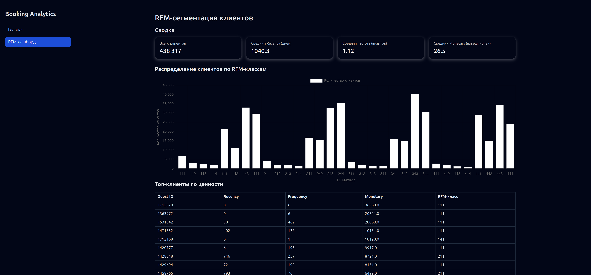
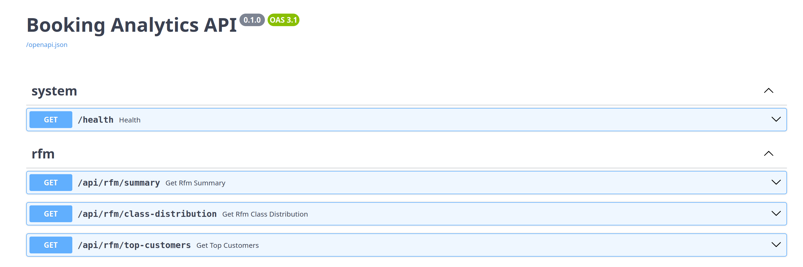
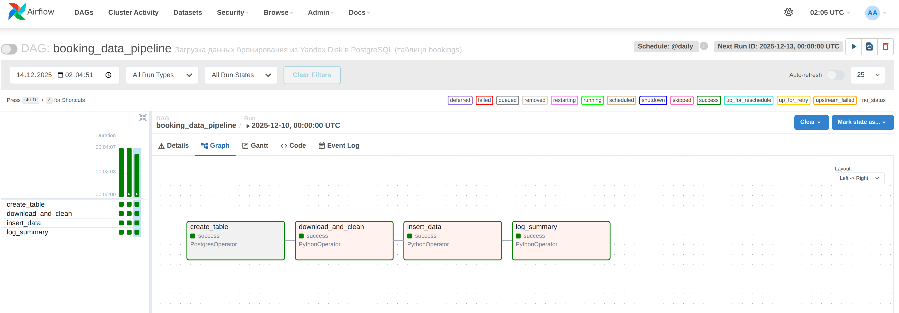
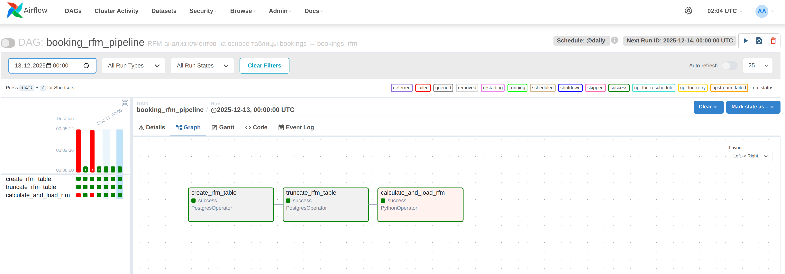

# Booking RFM Analytics (Airflow → PostgreSQL → FastAPI → Vue)

Pet-проект: от сырых Excel-выгрузок бронирований до RFM-дашборда для маркетинга.

- **Data pipeline**: Python-DAG’и (Airflow) загружают Excel с Яндекс.Диска, чистят данные и пишут в PostgreSQL.
- **Data model**: таблица `bookings` (факт заселений) и производная таблица `bookings_rfm` с R/F/M и RFM-классами.
- **Backend**: FastAPI, который отдаёт агрегаты по RFM через REST-эндпоинты.
- **Frontend**: Vue 3 + Chart.js — интерактивный RFM-дашборд.
- **Infra**: всё разворачивается через Docker Compose.

---

## 1. Архитектура






**Поток данных:**

1. Excel с бронированиями лежит на **Яндекс.Диске**.
2. Скрипты из `dags/ETL.py` и `dags/RFM.py` используются как DAG’и в Airflow:
   - `booking_data_pipeline`:
     - скачивает Excel с Я.Диска,
     - чистит данные (даты, числа, ID гостей),
     - загружает в таблицу `bookings` в PostgreSQL.
   - `booking_rfm_pipeline`:
     - читает `bookings`,
     - считает R, F, M и присваивает квартильные классы,
     - пишет результат в `bookings_rfm`.
3. **FastAPI** (`backend/app/main.py`) читает `bookings_rfm` и отдаёт RFM-метрики через REST.
4. **Vue-фронтенд** (`frontend/src/`) ходит в API и строит дашборд.

---

## 2. Технологии

- **Python / Data**
  - pandas
  - SQLAlchemy
  - Apache Airflow (код DAG’ов — в `dags/`)

- **База**
  - PostgreSQL 16 (`db/01_schema.sql`, `db/02_seed_bookings.sql`)

- **Backend**
  - FastAPI
  - Pydantic
  - Uvicorn

- **Frontend**
  - Vue 3 (Composition API, `<script setup>`)
  - Vite
  - Chart.js

- **Infrastructure**
  - Docker, Docker Compose

---

## 3. Как запустить (DB + backend + frontend)

Требования: установлен Docker и Docker Compose.

```bash
git clone https://github.com/<your-username>/booking-rfm-analytics.git
cd booking-rfm-analytics

# Сеть (если ещё не создана)
docker network create analytics-net || true

# Поднимаем всё приложение
docker compose up -d --build
